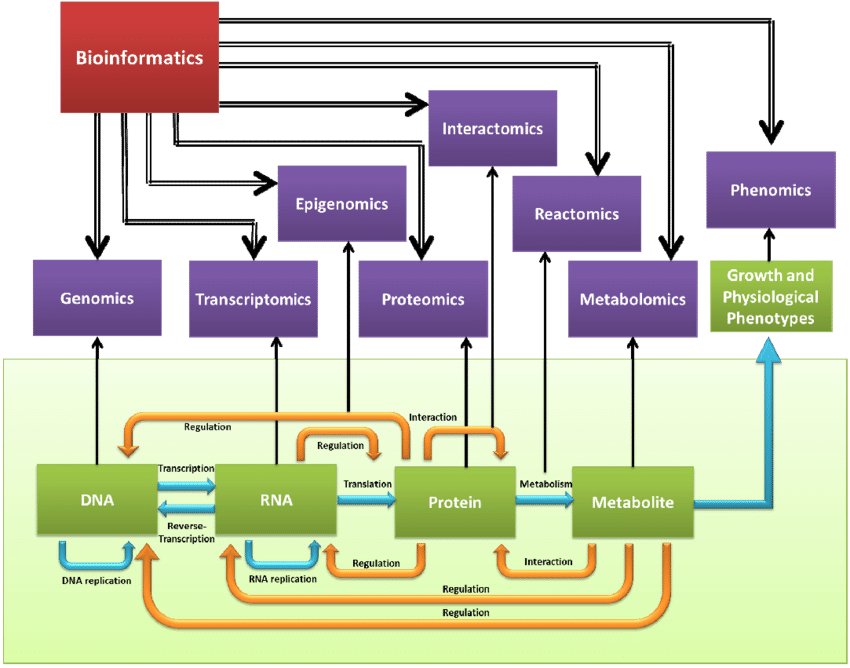

```{r setup, include=F, echo=F, eval=T}
library(knitr)
library(icons)
# source: https://github.com/gadenbuie/xaringanExtra
#xaringanExtra::use_animate_css()
#xaringanExtra::use_animate_all("slide_down")
xaringanExtra::use_scribble()
xaringanExtra::use_search(show_icon = TRUE)
xaringanExtra::use_tachyons()
xaringanExtra::use_webcam()
xaringanExtra::use_freezeframe()
htmltools::tagList(
  xaringanExtra::use_clipboard(
    button_text = "<i class=\"fa fa-clipboard\"></i>",
    success_text = "<i class=\"fa fa-check\" style=\"color: #90BE6D\"></i>",
    error_text = "<i class=\"fa fa-times-circle\" style=\"color: #F94144\"></i>"
  ),
  rmarkdown::html_dependency_font_awesome()
)
xaringanExtra::use_fit_screen()
xaringanExtra::use_extra_styles(
  hover_code_line = TRUE,         #<<
  mute_unhighlighted_code = TRUE  #<<
)
```

```{r xaringan-themer, include=FALSE, warning=FALSE, eval=FALSE}
xaringanthemer::style_mono_accent(
  base_color = "#43418A",
  header_font_google = google_font("Josefin Sans"),
  text_font_google   = google_font("Montserrat", "400", "300i"),
  code_font_google   = google_font("Fira Mono"), 
  link_color = "#ff9f9f"
)
```

class: middle

# Olá!

- Bem-vindos ao minicurso de Bioinformática da SemaBio, UnB.

- O curso será realizado em dois dias, nos quais:
    - Discutiremos as principais frentes de pesquisa e aplicação da Bioinformática na atualidade;
    
    - Realizaremos exercícios para estabelecer o primeiro contato com a área.

---
class: middle, center

# Temas a serem abordados

.left[
- [O que é a Bioinformática?](#sobre)

- [A essencialidade da Bioinformática](#essencialidade)

- [Principais conceitos (ou terminologias)](#conceitos)

- [Aplicações da Bioinformática](#aplicacoes)

- [Os pilares da Bioinformática](#pilares)

]

---
class: inverse, center, middle
name: sobre

# O que é a Bioinformática?

---

# O que é a Bioinformática?

--

- Campo interdisciplinar

    - Biologia, Genética, ciência da computação, estatística e matemática.

--

```{r, fig.align='center', fig.cap='Composição da Bioinformática.', out.width='300', echo=FALSE}
include_graphics('images/bioinformatics-computer-science-computational-biology.png')
```

.footnote[
<p style="font-size:0.5em">Fonte: https://microbenotes.com/bioinformatics-introduction-and-applications/</p> 
]

---

# O que é a Bioinformática?

- Campo interdisciplinar

    - Biologia, Genética, Ciência da Computação, Estatística e Matemática.

- Tem como principal **missão** solucionar problemas e questionamentos biológicos através de experimentos e metodologias **computacionais**.

--

    - Em resumo, é a área da ciência da computação que trabalha com análises de sequências de moléculas biológicas.
    
    - Geralmente sequências de DNA, RNA e proteínas.
--
.bg-washed-green.b--dark-green.ba.bw2.br3.shadow-5.ph4.mt0[
`r icon_style(fontawesome("quote-left"), fill='black', scale=2)` You can think about bioinformatics as essentially the linguistics part of genetics. That is, the linguistics people are looking at patterns in language, and that’s what bioinformatics people do–looking for patterns within sequences of DNA or protein.

.tr[
-- <cite>Christopher P. Austin, M.D.</cite>
]]
---
class: inverse, center, middle
name: essencialidade

# Por que ela é essencial?

---

# Por que ela é essencial?

.pull-left[
- Nos últimos anos, avanços tecnológicos permitiram o desenvolvimento metodologias custo-efetivas de alto desempenho para caracterização de sistemas biológicos.

    - Este baixo custo nos levou a era do [_big data_](https://en.wikipedia.org/wiki/Big_data).
{{content}}

]
--

- `r fontawesome("arrow-down")` custos = rotina = `r fontawesome("arrow-up")` dados
{{content}}

--

    - Por exemplo, uma das corridas de sequenciamento de menor desempenho da [plataforma Illumina](https://www.illumina.com/science/technology/next-generation-sequencing/sequencing-technology.html) chega a gerar uma quantidade de dados de 1.5 - 2.5 Gb.

--
.pull-right[
    
- Desta forma, a complexidade dos dados e a grande quantidade em que são gerados tornam necessário o auxílio de máquinas para sua análise e interpretação.

```{r, fig.align='center', fig.cap='Estrutura de um arquivo FASTQ.', out.width='450', echo=FALSE}
include_graphics('images/fastq_fig.jpg')
```

]

---
class: inverse, center, middle
name: conceitos

# Principais conceitos

---

# Principais conceitos

- Sem dúvidas, **sequências de DNA** são o tipo de dado mais abundante em Bioinformática.

--

```{r, fig.align='center', fig.cap='Estrutura e composição do DNA', out.width='500', echo=FALSE}

```

---

# Principais conceitos

- Sem dúvidas, **sequências de DNA** são o tipo de dado mais abundante em Bioinformática.

- Em um organismo, a sequência completa de seu DNA é denominada **_genoma_**.

    - O tamanho de um genoma é extremamente variável...

--

- Por exemplo, o tamanho médio de um genoma bacteriano da espécie _Escherichia coli_ é de aproximadamente 4,6 Mb, enquanto que o genoma humano tem em média aproximadamente 3.200 Mb.
    
```{r, fig.align='center', fig.cap='', out.width='400', echo=FALSE}

```

---

# Principais conceitos

- Sem dúvidas, **sequências de DNA** são o tipo de dado mais abundante em Bioinformática.

- Em um organismo, a sequência completa de seu DNA é denominada **_genoma_**.
    - O tamanho de um genoma é extremamente variável...

- Genomas, por sua vez, são constituídos por diversas regiões/sequências menores que podem ser classificadas em:

--

    - **Codificantes**: _que codificam proteínas_
    
    - **Não codificantes**: _que não codificam proteínas_

--

- Destas regiões, surge o conceito de **gene**, que são pequenas regiões do genoma que contém instruções para a produção de uma molécula específica (**geralmente** uma proteína, mas não sempre).

---

# Principais conceitos

- Destes conceitos, surge um dos fluxos de informação mais conhecidos na Biologia, chamado de **_Dogma central da Biologia_**.

--

- Nele, uma molécula de DNA é utilizada para a síntese de um RNA mensageiro (transcrição), que é então usado para a síntese de proteínas através de tradução.

    - Temos na figura a representação das principais moléculas biológicas analisadas/estudadas pela Bioinformática.

<br>

```{r, fig.align='center', fig.cap='Dogma central da Biologia.', out.width='500', echo=FALSE}
include_graphics('images/dogma-central-biologia-molecular2.jpg')
```

---
class: inverse, center, middle
name: pilares

# Os pilares da Bioinformática

---
class: middle

# Os pilares da Bioinformática

- Para analisar os dados e alcançar seus objetivos, a Bioinformática conta com três pilares fundamentais:

    - **Bancos de dados biológicos**
    - **_Software_ e ferramentas especializadas**.
    - **_Open source Science_**

---

# Bancos de dados biológicos

- Bancos de dados são desenvolvidos com o **principal objetivo** de organizar um conjunto de informações de maneira hierarquizada para permitir a rápida recuperação de informações.

--

.pull-left[
```{r, fig.align='center', fig.cap='', out.width='250', echo=FALSE}
include_graphics(c("images/bioinformatics-databases-1.png"))
```
<br>
```{r, fig.align='center', fig.cap='', out.width='350', echo=FALSE}
include_graphics(c("images/bioinformatics-databases-2.jpeg"))
```
].pull-right[

```{r, fig.align='center', fig.cap='', out.width='400', echo=FALSE}

```

]

.footnote[
<p style="font-size:0.5em">Fonte das imagens: Digital World Biology</p> 
]

---

# Bancos de dados biológicos

- Por isso ... deve-se sempre tomar bastante cuidado.

- É de suma importância conhecer e entender as capacidades e limitações de cada banco de dados.

<br>

```{r, fig.align='center', fig.cap='', out.width='400', echo=FALSE}

```

.footnote[
<p style="font-size:0.5em">Fonte das imagens: https://doi.org/10.1371/journal.pcbi.1005128</p> 
]

---

# Ferramentas de bioinformática

- As ferramentas bioinformáticas (_Open access_ <sup>`r icon_style(academicons("open-access"), scale=1.5)``r fontawesome("github")``r fontawesome("bitbucket")`</sup>) tem enorme impacto no avanço da Bioinformática e na mudança de paradigmas tanto da pesquisa (aquisição) quanto da exploração de informação.
    
    - Elas são imprescindíveis pois permitem que pesquisadores analisem e interpretem, de forma automatizada e eficiente, a grande quantidade e diversidade de dados biológicos produzidos atualmente.

<br>
.bg-washed-green.b--dark-green.ba.bw2.br3.shadow-5.ph4.mt0[
  `r icon_style(fontawesome("quote-left"), fill='black', scale=2)` The development of novel and powerful bioinformatics tools dedicated to biological data acquisition, data mining, and analysis empowered both the basic and applied life sciences research.
  
  .tr[
  -- Sousa, Sílvia et. al. 2016<sup> 1</sup>
  ]
]

.footnote[
<p style="font-size:0.6em">
<br>
`r fontawesome("github")`: https://github.com/
<br>
`r fontawesome("bitbucket")`: https://bitbucket.org
<br>
<b>1</b>: https://doi.org/10.1155/2016/3603827
</p> 
]

---

# Por exemplo ...

### A montagem de genomas

- O que significa montar um genoma?

--

    - Por montagem de genoma entende-se encontrar sobreposições entre as pequenas "peças" (sequências) adquiridas durante o sequenciamento e assim produzir uma sequência, ou uma peça, maior (_contigs_).

```{r, fig.align='center', fig.cap='Teoria da montagem de genomas.', out.width='400', echo=FALSE}
include_graphics("images/genome-assembly-theory.jpg")
```
    
---

# Mas ...

- Ao sequenciar um genoma obtemos milhões (geralmente 1-5 milhões por amostra) de pequenos fragmentos do genoma total.

    - Como poderíamos montar um quebra-cabeças assim tão grande, e para piorar, tão repetitivo?


```{r, fig.align='center', fig.cap='O problema da montagem de genomas.', out.width='500', echo=FALSE}

```

---

# Ferramentas computacionais são essenciais

- Esta tarefa (da montagem de genomas) seria impossível de ser realizada manualmente

- Por isso, ferramentas computacionais fazem parte da essência da Bioinformática

    - Por exemplo, as ferramentas utilizadas para a montagem de genomas são denominadas "montadores" (_assemblers_, em inglês)

---

    - Porém, assim como acontece com os bancos de dados, existem inúmeras ferramentas disponíveis para a mesma tarefa, e cada um com sua particularidade e objetivo
    
    - Por isso, é muito importante entendê-las antes de usá-las para procurar aquela que mais se adeque aos seus objetivos ... Muitas vezes, mais de uma serão necessárias para comparar ou complementar os resultados
    
```{r, fig.align='center', fig.cap='', out.width='600', echo=FALSE}

```

.footnote[
<p style="font-size:0.5em">Fonte: https://doi.org/10.1099/mgen.0.000409</p> 
]

---
class: middle

# Soluções bioinformáticas

- De maneira geral, soluções bioinformáticas envolvem:

    - Coletar estatísticas/informações de dados biológicos.
    
    - Desenvolver um modelo computacional.
    
    - Resolver um problema de modelagem computacional.
    
    - Testar e avaliar algoritmos computacionais.
    
    - Interpretar e analisar os dados com auxílio de bancos de dados.

---
class: inverse, center, middle
name: break

# Pausa

### Alguma dúvida até o momento?

<center>
<div class="tenor-gif-embed" data-postid="6081931" data-share-method="host" data-width="35%" data-aspect-ratio="1.565217391304348"><a href="https://tenor.com/view/confused-math-what-wtf-peep-gif-6081931">Confused Math GIF</a> from <a href="https://tenor.com/search/confused-gifs">Confused GIFs</a></div><script type="text/javascript" async src="https://tenor.com/embed.js"></script>
</center>

---
class: inverse, center, middle
name: aplicacoes

# Aplicações da Bioinformática

---

# Aplicações da Bioinformática

.pull-left[
- Sem dúvidas, a aplicação mais comum é a predição do conteúdo/potencial genético e proteico de um genoma.

    - Ou seja, determinar as funções gênicas ou proteicas.
  
- Outros casos também bastante comuns são:

    - Estabelecimento de relações evolutivas (Filogenia)
    
    - Predição de estruturas 3D de proteínas
    
    - Quantificação da expressão gênica
    
    - Medicina personalizada
    
    - Desenvolvimento de drogas
    
    - Estudo das mudanças climáticas, etc.
]

.pull-right[
```{r, fig.align='center', fig.cap='Genômica "translacional" e medicina de precisão de doenças complexas.', out.width='450', echo=FALSE}

```
]

---
class: inverse, center, middle

# Áreas da Bioinformática

---
class: middle

# Áreas da Bioinformática

- Desta forma, a Bioinformática compreende o estudo e análise de todas as moléculas biológicas de um organismo.

    - Não necessariamente ao mesmo tempo!

- Consequentemente, divide-se em diversas áreas (_ômicas_) que são nomeadas de acordo com o tipo de dado e molécula analisados.

    - Dentre elas, as principais ômicas atualmente são: a **Genômica**, **Transcritômica**, **Proteômica** e **Metabolômica**.

---

# Áreas da Bioinformática

- **Genômica**

    - É o termo atribuído ao estudo do genoma, objetivando entender a organização e a função de genes e da informação genética.

--

- **Transcritômica**

    - É o termo atribuído ao estudo do conjunto de transcritos (sequências de RNA) de um organismo, tem como principal objetivo obter, analisar e interpretar dados da expressão gênica.

--

- **Proteômica**

    - É o termo atribuído a estudos globais e em larga escala de Proteomas (conjunto de proteínas e suas isoformas). Tem como principal objetivo fornecer arcabouço necessário para o entendimento de processos fisiológicos e das relações entre [genótipo](https://www.genome.gov/genetics-glossary/genotype) e [fenótipo](https://www.genome.gov/genetics-glossary/Phenotype).

--

- **Metabolômica**

    - É o termo atribuído aos estudos e análises mais abrangentes e quantitativos do metaboloma (conjunto de metabólitos) de um organismo.

---
class: middle

```{r, fig.align='center', fig.cap='Resumo gráfico das principais ômicas aplicadas em Bioinformática.', out.width='700', echo=FALSE}

```

---
class: inverse, center, middle

# Aplicações recentes

---

# COVID-19

- A Bioinformática está tendo papel fundamental no estudo, catalogação e vigilância da COVID-19 (causada pelo Sars-CoV-2)

    - [Essential interpretations of bioinformatics in COVID-19 pandemic](https://www.sciencedirect.com/science/article/abs/pii/S2214540020301997?via%3Dihub)
    
    - [Computational strategies to combat COVID-19: useful tools to accelerate SARS-CoV-2 and coronavirus research](https://academic.oup.com/bib/article/22/2/642/5955939) (resumo mostrado abaixo)
    
```{r, fig.align='center', fig.cap='', out.width='700', echo=FALSE}

```

---

# COVID-19

- Diversas ferramentas e consórcios estão se provando essenciais nesta luta

    - [GISAID](https://www.gisaid.org/)
        - [Colaborações GISAID](https://www.gisaid.org/collaborations/enabled-by-hcov-19-data-from-gisaid/)
    - [covSPECTRUM](https://cov-spectrum.ethz.ch/explore/Switzerland/AllSamples/AllTimes)
    - [Covid Regeneron](https://covid19dashboard.regeneron.com/?tab=Home&subTab=Europe)
    - [Mutation reports](https://outbreak.info/situation-reports)
    - [CoVariants](https://covariants.org/)
    - [covizu](http://filogeneti.ca/covizu/)
    - [Nextstrain](https://nextstrain.org)
    - [Nextclade](https://clades.nextstrain.org/results)
    - [Pangoling lineage assigner](https://pangolin.cog-uk.io/)
    - [Cadde - USP / Oxford](https://www.caddecentre.org/)
    - [Outbreak - USP](https://outbreak.sysbio.tools/)
    - [Covid-miner](https://covid-miner.ifo.gov.it/app/home)
    - Entre outras

.bg-washed-green.b--dark-green.ba.bw2.br3.shadow-5.ph4.mt0[
  Algumas destas ferramentas serão exemplificadas / mostradas nos próximos slides ou utilizadas na aula prática.
]

---

# GISAID

- GISAID foi idealizado em 2006 com o intuito de permitir o rápido compartilhamento de informações e de dados de influenza.

- Atualmente, este consórcio encontra-se empenhado em aplicar seus conhecimentos adquirios ao longo dos anos para a vigilância, epidemiologia genômica e combate ao SARS-CoV-2

.pull-left[
```{r, fig.align='center', fig.cap='Genoma de referência do SARS-CoV-2 com informações sobre suas proteínas e sequência.', out.width='500', echo=FALSE}

```
]

.pull-right[
```{r, fig.align='center', fig.cap='Rastreamento de mutações encontradas na sequência da proteína Spike RBD.', out.width='500', echo=FALSE}

```
]

---

# Nextstrain

- Nextstrain é uma ferramenta pública e gratuita idealizada para o monitoramento rápido e em tempo real da evolução de patógenos ([docs](https://docs.nextstrain.org/en/latest/index.html)).
    - Atualmente, o grupo mantém estudos focados e se encontra engajado na vigilância do SARS-CoV-2.

```{r, fig.align='center', fig.cap='', out.width='500', out.height='400', echo=FALSE}

```

---

# Nextstrain

```{r, fig.align='center', fig.cap='', out.width='95%', echo=FALSE}

```

---

# Outras aplicações e bancos de dados

- [CARD](https://card.mcmaster.ca/analyze/rgi), banco de dados curado de genes de resitência em genomas bacterianos.

- [VFDB](http://www.mgc.ac.cn/VFs/main.htm), banco de dados de fatores de virulência bacterianos

- [PLSDB](https://ccb-microbe.cs.uni-saarland.de/plsdb/), banco de dados de plasmídeos.

- [ICEberg](https://db-mml.sjtu.edu.cn/ICEberg/), banco de dados de elementos integrativos e conjugativos bacterianos.

- [Ensembl](http://www.ensembl.org/index.html), banco de dados de genomas e anotações curadas de diversos organismos.

- Entre outros

---

# Referências

- Introduction to bioinformatics - https://pubmed.ncbi.nlm.nih.gov/24272431/
- NIH Bioinformatics - https://www.genome.gov/genetics-glossary/Bioinformatics
- Bioinformática (Big Data) - https://www.ncbi.nlm.nih.gov/pmc/articles/PMC5604462/
- Quantidade aproximada de dados por sequenciamentos Illumina - https://support.illumina.com/bulletins/2018/01/approximate-sizes-of-sequencing-run-output-folders.html
- Genoma da E. coli K-12 - https://pubmed.ncbi.nlm.nih.gov/9278503/
- O genoma humano (NCBI) - https://www.ncbi.nlm.nih.gov/books/NBK21134/
- Aplicações da Bioinformática (JPB) - https://www.longdom.org/scholarly/applications-of-bioinformatics-journals-articles-ppts-list-2874.html
- Bioinformatics Applications in Life Sciences and Technologies - https://doi.org/10.1155/2016/3603827
- Bioinformatics- Introduction and Applications: https://microbenotes.com/bioinformatics-introduction-and-applications/
- Translational genomics and precision medicine: Moving from the lab to the clinic - https://science.sciencemag.org/content/365/6460/1409/tab-figures-data
- Outras referências estão referenciadas através de suas urls diretamente nos slides.